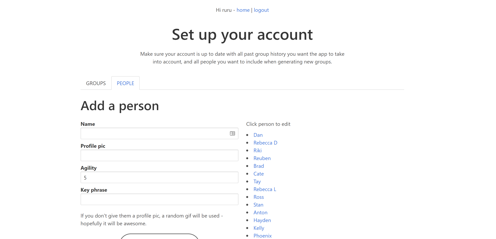
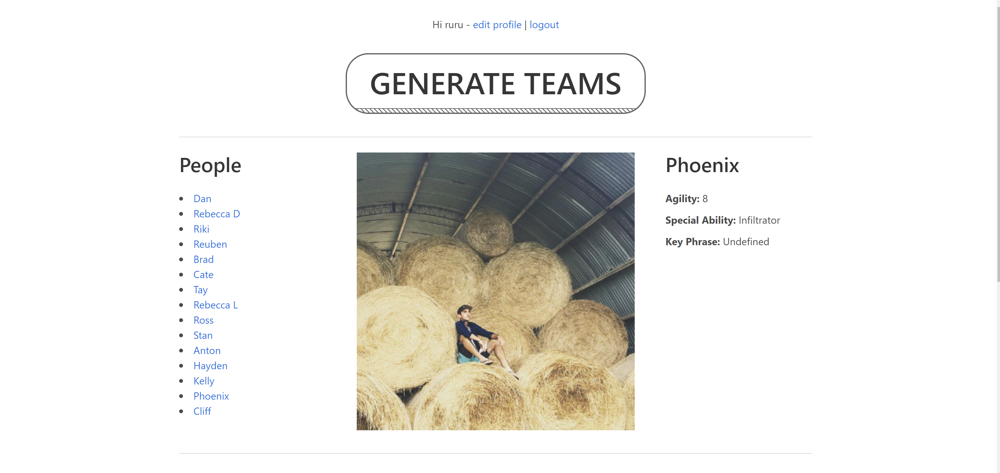

# Team Builder

https://the-sorting-hat.herokuapp.com/

Makes better teams for group projects where people are paired up with the least people they have worked with before in past projects.

App is now account-based with full account building functionality. You're able to costomise a list of all team-members, input past project pairing history and dynamically generate the best possible team structure for them. 🚀🚀🚀.

- Select team members from left hand list for more info.
- When you're ready to generate teams, hit the button, select the amount of teams and the number split and go!

If you're setting up your account from scratch:

- Select 'edit profile' from the top nav.
- Add all your people in the people tab top left.
- Once you've got some people, add any past group history in the group tab that you want the app to take into account when generating shiny new groups.
- Make some groups!

------------------------

### Tech:
React / Redux front-end using:
- Thunk and Superagent for async redux server requests
- HashRouter for client-side routing
- Webpack
- Bulma CSS framework
- A shitload of ternaries...

Node Express / Knex back-end using:
- jsonwebtoken for account token generation
- bcrypt for password hashing
- sqlite3 dev db environment
- https://pokeapi.co/ for people's special abilities because why not
- https://developers.giphy.com/ for placeholder profile gifs
- ze most complicated algorithm i've come up with yet to generate 100 possible team configurations, compare on two axis and deliver the best one
- Toby Morris's art because it's awesome

Deployed on Heroku - running postgresql production environment
